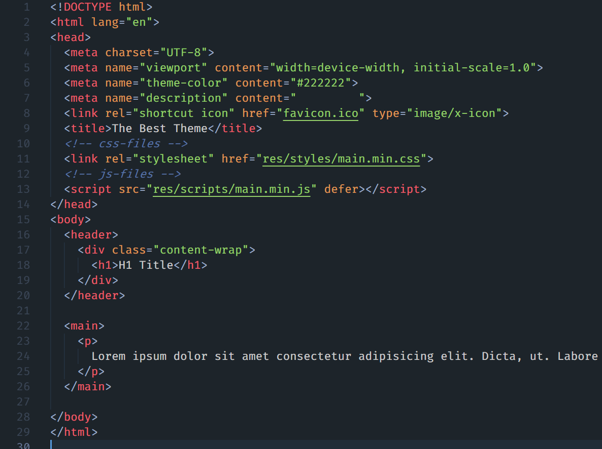
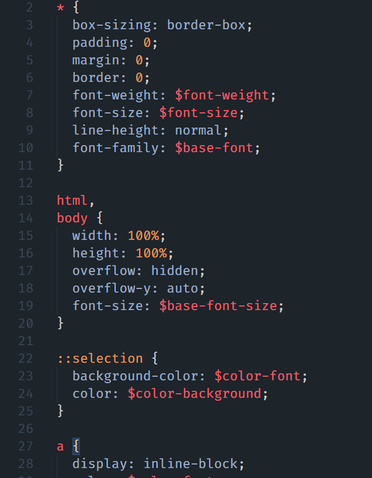
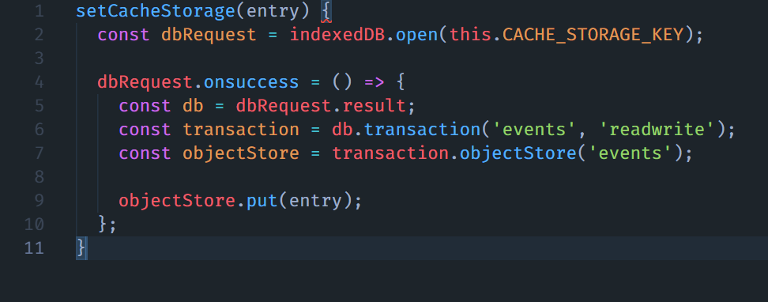

# The Best Theme


<br>

## The one and only VS Code Theme

Inspired and based on:
- [VS Code Material Theme](https://github.com/material-theme/vsc-material-theme)
- [Atom One Dark Theme](https://github.com/akamud/vscode-theme-onedark)

<br>

If you want to support me and my work:<br><br>
<a href="https://www.buymeacoffee.com/jankohlbach" target="_blank">
  
</a>

You can find me here:
- Web: [jankohlbach.com](https://jankohlbach.com)
- Social: @jankohlbach

<br>

---

<br>

### HTML File example


### CSS File example


### JS File example


<br>

---

<br>

## Installing

Go to Extensions and search for 'The Best Theme' and install it.<br>
That's it!<br>
[VS Code Marketplace](https://marketplace.visualstudio.com/items?itemName=kohlbachjan.the-best-theme)


## Issues

If you find any weird colors or combinations, feel free to open an issue of what feels wrong and a sample so I can look it up.<br>
Also do that if you find a crazy pink color anywhere, I used that one (#ff00dd) if I haven't found out where it's applied :D


## Fonts

I use `Fira Code` with a font weight of 400 for the Theme.<br>
If you download it and install it on your machine, you can set it in your settings.json like this:

```json
{
  "editor.fontFamily": "Fira Code",
  "editor.fontWeight": "400",
}
```


## Customization

If you want to override any styles you can easily do that.<br>
You can find a full reference of all the color keys [here](https://code.visualstudio.com/api/references/theme-color).<br>
Then use it in your settings.json like this:

```json
{
  "workbench.colorCustomizations": {
    "button.background": "#ff0000"
  },
}
```
